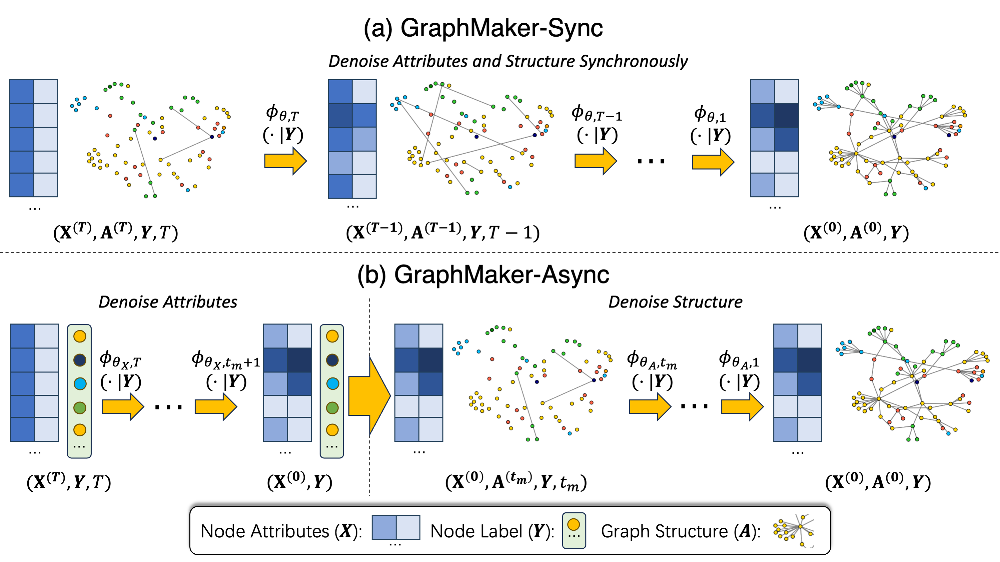

# GraphMaker



## Table of Contents

- [Installation](#installation)
- [Usage](#usage)
  * [Train](#train)
  * [Sample](#sample)
- [Frequently Asked Questions](#frequently-asked-questions)
  * [Q1: libcusparse.so](#q1-libcusparseso)
  * [Q2: Wandb](#q2-wandb)
  * [Q3: Other Requests](#q3-other-requests)

## Installation

```bash
conda create -n GraphMaker python=3.8 -y
conda activate GraphMaker
pip install torch==1.12.0+cu116 torchvision==0.13.0+cu116 torchaudio==0.12.0 --extra-index-url https://download.pytorch.org/whl/cu116
conda install -c conda-forge cudatoolkit=11.6
pip install dgl==1.1.0+cu116 -f https://data.dgl.ai/wheels/cu116/repo.html
pip install pandas scikit-learn pydantic wandb
```

You also need to compile `orca.cpp`.

```bash
cd orca
g++ -O2 -std=c++11 -o orca orca.cpp
```

## Usage

### Train

```bash
# The GraphMaker-Sync variant simultaneously generates node attributes and graph structure.
python train_sync.py -d D
# The trained model checkpoint will be saved to {D}_cpts/Sync_XXX.pth

# The GraphMaker-Async variant first generates node attributes, and then generates graph structure.
python train_async.py -d D
```

`D` can be one of the four built-in datasets, including `cora`, `citeseer`, `amazon_photo`, `amazon_computer`.

### Sample

```bash
python sample.py --model_path P
```

`P` is the path to a model checkpoint saved in the training stage.

## Frequently Asked Questions

### Q1: libcusparse.so

**An error occurs that the program cannot find `libcusparse.so`.**

To search for the location of it on linux,

```bash
find /path/to/directory -name libcusparse.so.11 -exec realpath {} \;
```

where `/path/to/directory` is the directory you want to search. Assume that the search returns `home/miniconda3/envs/GraphMaker/lib/libcusparse.so.11`. Then you need to manually specify the environment variable as follows.

```bash
export LD_LIBRARY_PATH=home/miniconda3/envs/GraphMaker/lib:$LD_LIBRARY_PATH
```

### Q2: Wandb

**What is WandB?**

[WandB](https://wandb.ai/site) is a tool for visualizing and tracking your machine learning experiments. It's free to use for open source projects. You may also use our code without it.

### Q3: Other Requests

**I have a question or request not listed here.**

- It's generally recommended to open a GitHub issue. This allows us to track the progress, and the discussion might help others who have the same question.
- Otherwise, you can also send an email to `mufeili1996@gmail.com`.
